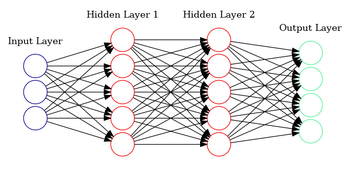

# Neural Netowrks with TensorFlow
In this workshop we will be .....

## What is Tensorflow?
```Tensorflow(TF)``` is an open source library for numerical computation and machine learning. Initially when ```Tensorflow 1.0``` was released, it had a high learning curve do to its unconventional structure and un-pythonic syntax. This led to the release of ```Tensorflow 2.0``` which incorporated ```Keras```; a simple to use deep learning framework. Due to this change Tensorflow is now intuitive and easy to use.

### How does Tensorflow work?
Tensorflow uses ```tensors``` for their computation. A tensor is an immutable multidimensional array with a uniform datatype. This can be see as similar to a [Numpy](https://numpy.org/) array.

Let's see how we can implement a tensor using Tensorflow
```python
import tensorflow as tf

t_one = tf.constant([1,2,3])
print("[1]", t_one)

t_two = tf.constant([5])
t_three = tf.multiply(t_one, t_two)
print("[2]", t_three)
```
**print log**
```
[1] tf.Tensor([1 2 3], shape=(3,), dtype=int32)
[2] tf.Tensor([ 5 10 15], shape=(3,), dtype=int32)
```

As you can see above, we used the ```tf.constant()``` class to create an instance of a tensor. We were also able to use functions such as ```tf.multiply()``` in order to perform an operation on our tensors. For the more information on tensors in tensorflow you can check out the documentation [here](https://www.tensorflow.org/guide/tensor). 

## What are Neural Networks?

```Neural Networks(NN)``` are sets of interconnected neurons that take in a large set of data and aim to discover an underlying pattern. While neural networks don't exactly emulate our biological neural networks, they are ```loosely inspired``` by how our brains learn.

Our brain doesn't learn concepts instantly, it usually takes different iterations of explanations and even trial and error to solidify our understanding of an idea. Imagine if you had no understanding of what cats and dogs were. If I showed you thousands of different pictures of cats and dogs, you would start to form an understanding and eventually you would become more confident in telling me which pictures were cats and which were dogs. While oversimplified, this is the basis of how neural networks learn.

Now that you have a high level overview of how neural networks learn, let's dive deeper and take a look at their structure.



Above, we can see an example image. The neural network is composed of 3 types of layers:
- **Input Layer**—This is the input of our network where we pass in our data(This could be text, images, sound, etc.) 
- **Hidden Layer**—This layer falls in between the input and output layers. It does the mapping between the input and output layers by performing a series of mathematical operations
- **Output Layer**—This can be seen as the results of our network

> The term "deep learning" comes from neural networks with more than 1 hidden layer. These types of neural networks are called deep neural networks. The neural network figure above displays a deep neural network because it contains 2 hidden layers. Neural networks with only 1 hidden layer can be referred to as simple neural networks.

### What is the function of the neuron?
Each neuron performs a set of mathematical operations to derive an output.


Above is an example of a randomly selected neuron. Each neuron will have a connection with every neuron in the previous layer. The way each neuron obtains its value is simple. It begins by summing up every input. The input consists of the input value(x) as well as an associated weight(w). When the model is trained, these weights shift around in order to get the optimal model. The weights carry influence as to how strong a connection between two neurons are. The higher the weight the influence of the neuron. 


Above we summed up every input which consisted of the input multiplied by the weight. We can further simplify this as the summation equals the dot product of the vectors x and w.

Furthermore, we also have to add the bias(b) term to transpose the constant value to obtain the output values.


Finally, to obtain the neurons output value, we pass it through an activation function in order to introduce non-linearity into the neurons output. Without the activation function, our neural network is essentially a linear regression model. With the activation function, our model is able to learn more complex tasks. There are several activation functions, but in this post we will be going over the **ReLU activation function**.